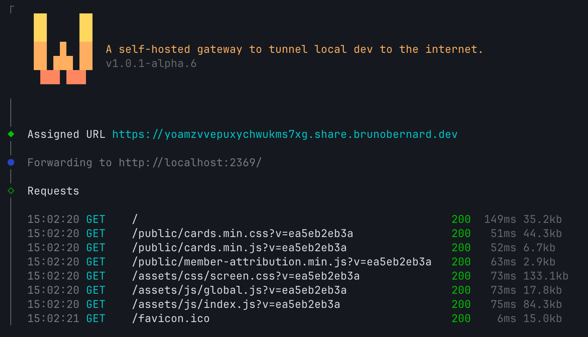

# w



A self-hosted alternative to ngrok to tunnel local HTTP to the web.

## Client

### Install

The release installer downloads the matching macOS or Linux binary for your machine, verifies it with `checksums-sha256.txt`, and installs it to `~/.local/bin/w` by default.

```bash
curl -fsSL https://raw.githubusercontent.com/eznix86/w-share/main/install.sh | sh
```

Pin a specific release by passing the tag explicitly.

```bash
curl -fsSL https://raw.githubusercontent.com/eznix86/w-share/main/install.sh | sh -s -- v1.0.1-alpha.0
```

Override the install directory with `W_INSTALL_DIR` if you want a different target path.

```bash
curl -fsSL https://raw.githubusercontent.com/eznix86/w-share/main/install.sh | W_INSTALL_DIR=/usr/local/bin sh -s -- v1.0.1-alpha.0
```

If `~/.local/bin` is not already in your `PATH`, add it in your shell profile:

```bash
export PATH="$HOME/.local/bin:$PATH"
```

### Expose a local target

```bash
w http :8000
w http https://awesome-local-website.localhost
w share :8000 --qr
```

The client prompts for the server URL and shared token on first run and stores them in `~/.config/w-share/config.json`.

Use `--qr` to print a terminal QR code for the assigned public URL.

To update the saved client configuration later:

```bash
w config
```

## Server

### Run directly

```bash
W_SHARE_TOKEN=dev-token w serve --domain share.domain.tld --port 8080
```

Generate a token with:

```bash
openssl rand -hex 24
```

### Docker Compose

```yaml
services:
  w-share:
    image: ghcr.io/eznix86/w:1.0.0-alpha.1
    restart: unless-stopped
    command:
      - serve
      - --domain
      - share.domain.tld
      - --port
      - "8080"
    environment:
      W_SHARE_TOKEN: your-shared-token
    ports:
      - "8080:8080"
```

Replace:
- `share.domain.tld` with your public tunnel domain
- `your-shared-token` with the token used by your clients

### Kubernetes

Use `ghcr.io/eznix86/w:<tag>` in your Deployment and pass the server args to the container:

```yaml
containers:
  - name: w-share
    image: ghcr.io/eznix86/w:1.0.0-alpha.1
    imagePullPolicy: IfNotPresent
    args:
      - serve
      - --domain
      - share.domain.tld
      - --port
      - "8080"
    env:
      - name: W_SHARE_TOKEN
        valueFrom:
          secretKeyRef:
            name: w-share-auth
            key: token
```

Your Ingress should route both the root domain and wildcard subdomains to the same service:

```yaml
apiVersion: networking.k8s.io/v1
kind: Ingress
metadata:
  name: w-share
spec:
  ingressClassName: nginx
  rules:
    - host: share.domain.tld
      http:
        paths:
          - path: /
            pathType: Prefix
            backend:
              service:
                name: w-share
                port:
                  number: 80
    - host: '*.share.domain.tld'
      http:
        paths:
          - path: /
            pathType: Prefix
            backend:
              service:
                name: w-share
                port:
                  number: 80
```

Replace:
- `share.domain.tld` with your public tunnel domain
- `w-share` with your Service name if different

If you use cert-manager, request a certificate for both the root domain and wildcard subdomain:

```yaml
apiVersion: cert-manager.io/v1
kind: Certificate
metadata:
  name: w-share-tls
spec:
  secretName: w-share-tls
  issuerRef:
    name: your-cluster-issuer
    kind: ClusterIssuer
  dnsNames:
    - share.domain.tld
    - '*.share.domain.tld'
```

## License

[MIT](./LICENSE)
